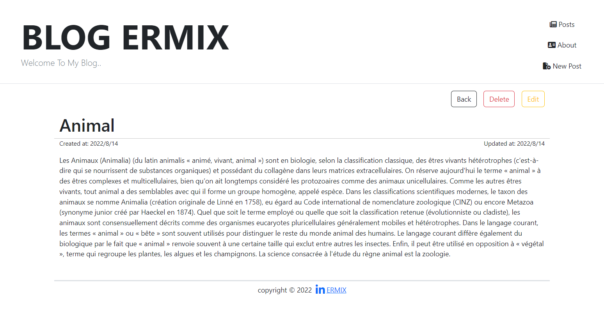

# Blog Web App With Express and MongoDB


## Introduction

> This is a simple web app that I built to practice my skills in building web apps.

## Screenshots
* All Posts

* Details Post

* Update Post

* Add Post

* About Post


## Build With:

| Front End       | Back End         | database        |
|-----------------|------------------|-----------------|
| HTML `EJS`      | NodeJs `Express` | NoSQL `MongoDB` |
| CSS `bootstrap` |                  |                 |
| JS              |                  |                 |

## Instructions

- [x] Create a web app that allows users to create a blog post.
- [x] The user should be able to see all the posts that have been created.
- [x] The user should be able to see a single post when they click on the title of the post.
- [x] The user should be able to edit a post.
- [x] The user should be able to delete a post.


## Requirements

* [Node.js](https://nodejs.org/)
* [Express](https://expressjs.com/)
* [MongoDB](https://www.mongodb.com/)
* [Mongoose](https://mongoosejs.com/)
* [Bootstrap](https://getbootstrap.com/)
* [Font Awesome](https://fontawesome.com/)

## Installation

> Run to install all dependencies:

```bash
npm install
```

## Usage

> ***watch mode `nodemon`*** Run the app with the following command:


```bash
npm start
```

## Contributing

> Contributions are welcome!
